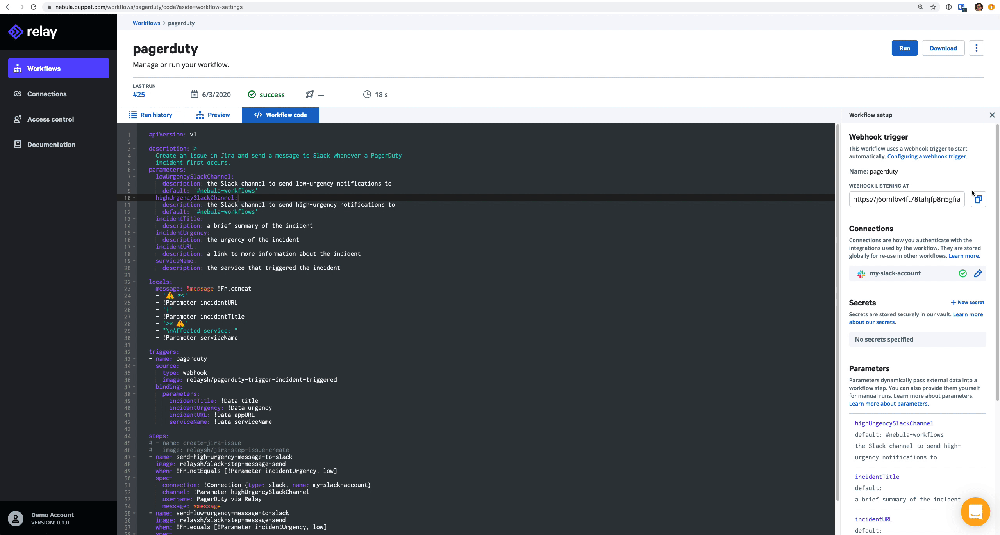

This workflow responds to a PagerDuty incident by sending a message to a Slack 
channel. The urgency of the incident determines which Slack channel the message 
goes to.

## Prerequisites

Before you run this workflow, you will need the following:
- A [Slack](https://slack.com/) workspace and a connection configured in Relay
  to that workspace.
- A [PagerDuty](https://www.pagerduty.com/) account.

## Configure the workflow

You may need to update some of the default parameters or connection information
in this workflow to run in your environment. The default configuration assumes:
- Your Slack connection is called `my-slack-account`
- You want high-urgency incidents to go to the `#on-call` Slack channel
- You want low-urgency incidents to go to the `#it` Slack channel

## Test the workflow

You can test the workflow with dummy data by clicking the **Run** button. Ensure
the message you expect shows up in your Slack workspace. We recommend always 
testing workflows manually before configuring automated triggers.

## Set up the trigger

When you create this workflow for the first time, we'll automatically provision
a webhook for you. You need to provide this webhook to PagerDuty to complete the
integration.  

In the workflow overview page in Relay, find the webhook URL by navigating to
the **Setup** sidebar. Copy the URL to your clipboard.  

In PagerDuty, determine which services you want to run the workflow when an
incident is triggered. For each of those services:  

1. Click on the **Integrations** tab.  
2. At the bottom of the page, click **Add or manage extensions**.  
3. Create a **New Extension**:  
   - Extension Type: `Generic V2 Webhook`  
   - Name: `Relay`  
   - URL: Paste the webhook URL from your clipboard.  
4. Click **Save**.  

Whenever an incident is triggered for the first time, this workflow will run.
You can reuse the same webhook URL for many services.  

